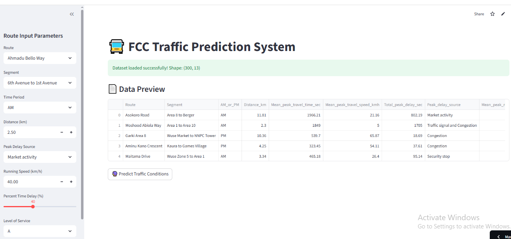

# 🚦 FCC Traffic AI

An AI-powered traffic prediction platform built with **Python, Streamlit, Machine Learning, and Pretrained Models** to forecast traffic speed, travel time, congestion level, and road condition using transportation route data.

This project demonstrates how **Artificial Intelligence, Data Science, and Transportation Analytics** can be integrated into an intelligent decision-support system for traffic monitoring and smart mobility planning.

---

# 🌐 Live Application

🔗 https://k-fcc-traffic-ai.streamlit.app/

---

# 📌 Project Overview

Traffic congestion remains one of the most significant challenges facing modern cities.

This project was developed to demonstrate how Machine Learning can assist transportation professionals by predicting key traffic performance indicators from road and operational characteristics.

Using pretrained machine learning models, the application predicts:

- Vehicle Speed
- Travel Time
- Traffic Congestion Level
- Road Condition

Users can configure different transportation scenarios and instantly receive AI-generated predictions to support transportation planning and operational decision-making.

---

# 🎯 Problem → Solution → Impact

## Problem

Transportation agencies and road users often require quick estimates of traffic conditions without carrying out expensive field surveys every time.

## Solution

This project combines **multiple machine learning models, interactive dashboards, and transportation analytics** into a single platform capable of predicting several traffic performance indicators simultaneously.

## Impact

The system demonstrates how AI can support:

- Intelligent Traffic Monitoring
- Urban Mobility Planning
- Smart Transportation Systems
- Road Performance Evaluation
- Data-Driven Decision Making

---

# 🚀 Key Features

## 📄 Dataset Preview

Displays the traffic dataset and confirms successful loading before predictions are performed.

---

## 🔍 Smart Route Inputs

Users can customize:

- Route
- Segment
- Time Period (AM / PM)
- Distance (km)
- Peak Delay Source
- Running Speed (km/h)
- Percent Time Delay (%)
- Level of Service

---

## 🤖 Multi-Model Prediction Engine

The application uses four pretrained machine learning models:

- 🚗 Speed Prediction Model
- ⏱ Travel Time Prediction Model
- 🚦 Traffic Level Classification Model
- 🛣 Road Condition Classification Model

The models are stored as `.pkl` files and loaded instantly using **Joblib**.

---

## 📊 Prediction Dashboard

Displays prediction results using interactive dashboard metrics:

- 🚗 Predicted Speed (km/h)
- ⏱ Estimated Travel Time (seconds)
- 🚦 Traffic Level
- 🛣 Road Condition

---

## ⚡ Fast Prediction

The application loads pretrained models without retraining, enabling rapid predictions and improved user experience.

---

# 📸 Application Screenshot

## 🖥️ Dashboard



---

# 📍 Dashboard Overview

The dashboard provides an interactive interface for predicting traffic conditions using Machine Learning.

## Sidebar Inputs

Users specify transportation parameters including:

- Route
- Road Segment
- Time Period
- Distance
- Peak Delay Source
- Running Speed
- Percentage Delay
- Level of Service

These variables become inputs to the prediction models.

---

## Dataset Preview

The application confirms successful dataset loading and displays a preview containing transportation variables such as:

- Route
- Segment
- Distance
- Peak Travel Time
- Peak Travel Speed
- Delay Source
- Delay Duration

---

## Prediction Results

After clicking **Predict Traffic Conditions**, the application simultaneously predicts:

- Vehicle Speed
- Travel Time
- Traffic Congestion Level
- Road Condition

The predictions are presented in a clean, easy-to-read dashboard.

---

# 🧠 Machine Learning Models

The application combines multiple Machine Learning models trained for different transportation tasks.

## Regression Models

- Random Forest Regressor (Vehicle Speed)
- Random Forest Regressor (Travel Time)

## Classification Models

- Random Forest Classifier (Traffic Level)
- Random Forest Classifier (Road Condition)

---

# 📊 Model Development & Evaluation

Rather than relying on a single prediction model, this project demonstrates how multiple Machine Learning models can work together within one intelligent transportation platform.

Each model was trained independently using transportation data and then saved as a reusable `.pkl` file.

This deployment strategy offers several advantages:

- Faster application startup
- No retraining during deployment
- Modular model updates
- Scalable production workflow

One important lesson from this project is that successful AI systems involve much more than model training.

> **Building production-ready Machine Learning applications requires effective data preprocessing, model management, deployment, and user-friendly interfaces in addition to predictive accuracy.**

Future development will focus on expanding the transportation dataset, improving feature engineering, evaluating additional algorithms, and incorporating real-time traffic information.

---

# 🏗️ System Architecture

```text
Traffic Dataset
        │
        ▼
Data Preprocessing
        │
        ▼
Feature Engineering
        │
        ▼
Multiple Trained Models
 ┌─────────┬─────────┬────────────┬────────────┐
 ▼         ▼         ▼            ▼
Speed    Time     Traffic     Condition
Model    Model     Model         Model
 └─────────┴─────────┴────────────┴────────────┘
                     │
                     ▼
           Streamlit Dashboard
                     │
                     ▼
       Intelligent Traffic Prediction
```

---

# 🛠️ Technology Stack

### Programming

- Python

### Machine Learning

- Scikit-learn
- Random Forest
- Joblib

### Data Analysis

- Pandas

### Deployment

- Streamlit

---

# 📂 Project Structure

```text
FCC-Traffic-AI/
│── assets/
│   └── Dashboard.png
│── FCC_Traffic_300.csv
│── app2.py
│── speed_model.pkl
│── time_model.pkl
│── traffic_model.pkl
│── condition_model.pkl
│── requirements.txt
│── README.md
```

---

# ⚙️ Installation

## Clone Repository

```bash
git clone https://github.com/kola56de/FCC-Traffic-AI.git

cd FCC-Traffic-AI
```

## Install Dependencies

```bash
pip install -r requirements.txt
```

## Run Application

```bash
streamlit run app2.py
```

---

# 🎯 Applications

- Intelligent Transportation Systems
- Smart Traffic Forecasting
- Urban Mobility Analytics
- Congestion Monitoring
- Public Transport Planning
- Road Performance Evaluation
- Transportation Decision Support
- Smart City Planning

---

# 📈 Future Roadmap

- Real-Time Traffic API Integration
- Interactive GIS Traffic Maps
- AI Congestion Forecasting
- Accident Delay Prediction
- Route Recommendation Engine
- GPS-Based Traffic Monitoring
- Power BI Executive Dashboard
- Mobile Application
- Larger Transportation Dataset
- Deep Learning Model Comparison

---

# 👨‍💻 Author

## **Engr. Dr. Kolade Olonisakin, FNSE**

**Civil Engineer | Data Scientist | Machine Learning Engineer | AI Engineer | Transportation & GIS Analytics**

🌍 **Portfolio**

https://olonisakin-emmanuel.github.io/OlonisakinEmmanuel.github.io/

💼 **LinkedIn**

https://www.linkedin.com/in/engr-dr-kolade-olonisakin-fnse/

💻 **GitHub**

https://github.com/kola56de

---

# ⭐ Support

If you found this project useful, please consider giving it a **⭐ Star** on GitHub.

Feedback, suggestions, and collaboration opportunities are always welcome.
